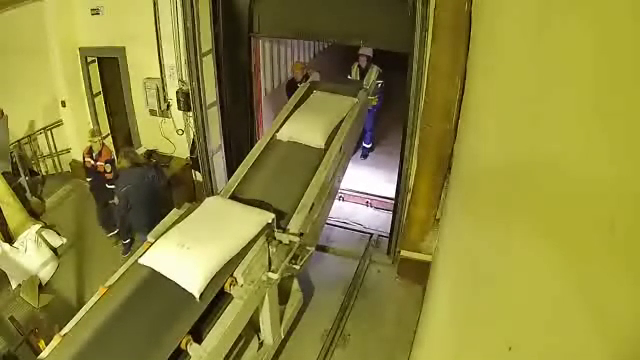
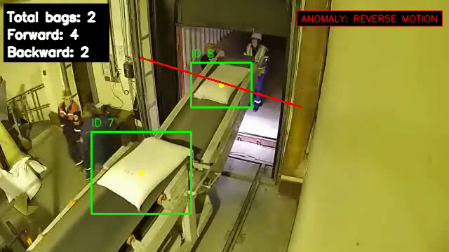

# Bag Counter

Web application for automatic bag detection, tracking and counting on conveyor video.

The system uses:
- MMDetection / RTMDet for bag detection
- ByteTrack for object tracking
- Directional line crossing for counting
- Reverse motion monitoring for anomaly detection
- FastAPI for the backend
- Docker for deployment

## Features

- Video upload
- Asynchronous video processing
- Bag detection and tracking
- Forward and backward bag counting
- Reverse conveyor motion anomaly detection
- Processing status API
- JSON processing results
- Processed video download
- Persistent job metadata
- Web interface

## Architecture

```text
Browser
   ↓
FastAPI
   ↓
Job service
   ↓
CV pipeline
   ↓
RTMDet
   ↓
ByteTrack
   ↓
Counter + anomaly detection
   ↓
Processed video + JSON result
```

## Model

The application uses a fine-tuned RTMDet-tiny detector for a single class:

```text
bag
```

Final inference checkpoint:

```text
models/rtmdet_bag.pth
```

The MMDetection configuration is stored in:

```text
configs/rtmdet_bag.py
```

## Computer Vision Pipeline

The processing pipeline consists of four main stages:

```text
Video frame
    ↓
RTMDet
    ↓
Bag detections
    ↓
ByteTrack
    ↓
Tracked bags
    ↓
Directional line crossing
    ↓
Bag counter
    ↓
Reverse motion monitoring
    ↓
Annotated output video + JSON result
```

### Detection

RTMDet detects bags on each video frame.

Detections with confidence below the configured threshold are removed before tracking.

Default detection threshold:

```text
0.10
```

### Tracking

ByteTrack assigns a persistent track ID to detected bags across frames.

Current tracking parameters:

```text
track_activation_threshold = 0.40
lost_track_buffer = 75
minimum_matching_threshold = 0.80
minimum_consecutive_frames = 3
```

### Counting

A bag is counted when the center of its tracked bounding box crosses the configured counting segment.

Forward crossing:

```text
+1
```

Backward crossing:

```text
-1
```

The final count is calculated as:

```text
total_bags = forward - backward
```

A dead zone around the counting line is used to reduce duplicate crossing events caused by bounding-box jitter.

### Reverse Motion Anomaly

The application monitors the motion of tracked bags relative to the counting line.

If sustained motion in the reverse direction is detected, the system stores an anomaly interval containing:

- anomaly type
- start frame
- end frame
- start time
- end time

This anomaly is also displayed on the processed video while reverse motion is active.

## Inference Example

| Original frame | Processed frame |
|---|---|
|  |  |

## Processing Result

Example result:

```json
{
    "total_bags": 125,
    "forward": 128,
    "backward": 3,
    "anomalies": [
        {
            "type": "reverse_motion",
            "start_frame": 2925,
            "end_frame": 4422,
            "start_time": 117.0,
            "end_time": 176.88
        }
    ]
}
```

## Local Installation

Python 3.10 is recommended.

Create a virtual environment.

### Windows

```powershell
python -m venv .venv
.venv\Scripts\Activate.ps1
```

### macOS / Linux

```bash
python3.10 -m venv .venv
source .venv/bin/activate
```

Install project dependencies:

```bash
python -m pip install -r requirements.txt
```

Install OpenMIM and MMCV:

```bash
python -m pip install openmim
mim install "mmcv==2.1.0"
```

MMCV installation may depend on the operating system, PyTorch version and CUDA configuration.

The project was tested with:

```text
torch       2.1.0
torchvision 0.16.0
mmcv        2.1.0
mmdet       3.3.0
mmengine    0.10.7
```

## Run Locally

Start the FastAPI server from the project root:

```bash
uvicorn app.main:app --reload
```

Open the web interface:

```text
http://127.0.0.1:8000/
```

Swagger API documentation:

```text
http://127.0.0.1:8000/docs
```

Health check:

```text
http://127.0.0.1:8000/health
```

## Docker

### Recommended: Docker Compose

The recommended way to run the application is Docker Compose.

From the project root:

```bash
docker compose up --build
```

After the container starts, open:

```text
http://localhost:8000
```

Uploaded videos, processed videos and job metadata are stored in the mounted `storage/` directory and remain available after the container is recreated.

To stop the application:

```bash
docker compose down
```

### Manual Build

Build the Docker image:

```bash
docker build -t bag-counter .
```

### Run with NVIDIA GPU

The application automatically uses CUDA when it is available.

#### Windows PowerShell

```powershell
docker run --rm --gpus all -p 8000:8000 -v "${PWD}\storage:/app/storage" bag-counter
```

#### Linux

```bash
docker run --rm --gpus all -p 8000:8000 -v "$(pwd)/storage:/app/storage" bag-counter
```

The mounted `storage` directory keeps uploaded videos, processed videos and job metadata outside the container.

### Check GPU Access

To verify that Docker can access the NVIDIA GPU:

```powershell
docker run --rm --gpus all nvidia/cuda:11.8.0-base-ubuntu22.04 nvidia-smi
```

To verify CUDA inside the project image:

```powershell
docker run --rm --gpus all bag-counter python -c "import torch; print('CUDA:', torch.cuda.is_available()); print('GPU:', torch.cuda.get_device_name(0) if torch.cuda.is_available() else 'None'); print('Torch:', torch.__version__)"
```

## Web Interface

The web interface supports the complete processing workflow:

```text
Select video
    ↓
Upload video
    ↓
Start processing
    ↓
Wait for background job
    ↓
View result
    ↓
Download processed video
```

The browser polls the backend while the video is being processed and displays the result after the job is completed.

## API

### Health Check

```http
GET /health
```

Example response:

```json
{
    "status": "ok"
}
```

### Upload Video

```http
POST /videos
```

The endpoint accepts a video file and stores it with a generated unique ID.

Example response:

```json
{
    "video_id": "c6add1c9-4757-412f-af4d-a8a4ca1dd087",
    "filename": "input.mp4",
    "path": "storage/c6add1c9-4757-412f-af4d-a8a4ca1dd087.mp4"
}
```

### Start Processing

```http
POST /jobs?video_id=<video_id>
```

Example response:

```json
{
    "job_id": "fc210e95-b01b-4044-8698-47d0614b8571",
    "status": "queued"
}
```

The processing runs in a background worker and does not block the HTTP request until inference is complete.

### Get Job Status

```http
GET /jobs/{job_id}
```

Possible statuses:

```text
queued
processing
completed
failed
```

Example completed job:

```json
{
    "job_id": "fc210e95-b01b-4044-8698-47d0614b8571",
    "status": "completed",
    "input_path": "storage/input.mp4",
    "output_path": "storage/output_counted.mp4",
    "result_path": "storage/output_results.json",
    "result": {
        "total_bags": 125,
        "forward": 128,
        "backward": 3,
        "anomalies": [
            {
                "type": "reverse_motion",
                "start_frame": 2925,
                "end_frame": 4422,
                "start_time": 117.0,
                "end_time": 176.88
            }
        ]
    },
    "error": null
}
```

### Get Processing Result

```http
GET /jobs/{job_id}/result
```

Returns only the final processing result for a completed job.

### Download Processed Video

```http
GET /jobs/{job_id}/video
```

Returns the processed MP4 video containing:

- bounding boxes
- track IDs
- bag center points
- counting line
- total count
- forward count
- backward count
- reverse motion anomaly indicator

## Asynchronous Processing

Long-running inference is executed with a background `ThreadPoolExecutor`.

The request that starts processing returns immediately with a job ID.

The client can then request the job status independently:

```text
POST /jobs
    ↓
queued
    ↓
processing
    ↓
completed
```

Only one processing worker is currently used:

```text
max_workers = 1
```

This prevents multiple inference jobs from competing for the same GPU at the same time.

## Persistent Job State

Job metadata is stored in:

```text
storage/jobs.json
```

Completed jobs remain available after the FastAPI server is restarted.

If the server is restarted while a job is in `queued` or `processing` state, the job is recovered as:

```text
failed
```

with the error:

```text
Job was interrupted by server restart
```

## Storage

Runtime files are stored inside:

```text
storage/
```

This includes:

```text
uploaded videos
processed videos
processing result JSON files
jobs.json
```

The directory is excluded from Git.

## CLI Processing

The CV pipeline can also be executed without FastAPI using:

```bash
python -m scripts.run_counter_video
```

The CLI runner uses the same `process_video()` function as the web application.


---

# Bag Counter

Веб-приложение для автоматического обнаружения, трекинга и подсчёта мешков на видео с конвейера.

В системе используются:
- MMDetection / RTMDet для детекции мешков
- ByteTrack для трекинга объектов
- Подсчёт пересечений направленной линии
- Мониторинг обратного движения для обнаружения аномалий
- FastAPI для backend
- Docker для развёртывания

## Возможности

- Загрузка видео
- Асинхронная обработка видео
- Детекция и трекинг мешков
- Подсчёт мешков в прямом и обратном направлениях
- Обнаружение обратного движения конвейера
- API для получения статуса обработки
- Результаты обработки в JSON
- Скачивание обработанного видео
- Сохранение состояния задач
- Веб-интерфейс

## Архитектура

```text
Браузер
   ↓
FastAPI
   ↓
Сервис задач
   ↓
CV pipeline
   ↓
RTMDet
   ↓
ByteTrack
   ↓
Счётчик + обнаружение аномалий
   ↓
Обработанное видео + JSON-результат
```

## Модель

Приложение использует дообученный детектор RTMDet-tiny для одного класса:

```text
bag
```

Финальный checkpoint для инференса:

```text
models/rtmdet_bag.pth
```

Конфигурация MMDetection хранится в:

```text
configs/rtmdet_bag.py
```

## CV пайплайн

Пайплайн обработки состоит из следующих основных этапов:

```text
Кадр видео
    ↓
RTMDet
    ↓
Детекции мешков
    ↓
ByteTrack
    ↓
Отслеживаемые мешки
    ↓
Пересечение направленной линии
    ↓
Счётчик мешков
    ↓
Мониторинг обратного движения
    ↓
Аннотированное видео + JSON-результат
```

### Детекция

RTMDet обнаруживает мешки на каждом кадре видео.

Детекции с confidence ниже заданного порога удаляются перед передачей в трекер.

Порог детекции по умолчанию:

```text
0.10
```

### Трекинг

ByteTrack присваивает обнаруженным мешкам устойчивый `track ID` между последовательными кадрами.

Текущие параметры трекера:

```text
track_activation_threshold = 0.40
lost_track_buffer = 75
minimum_matching_threshold = 0.80
minimum_consecutive_frames = 3
```

### Подсчёт

Мешок считается прошедшим, когда центр его отслеживаемого bounding box пересекает заданный отрезок подсчёта.

Пересечение в прямом направлении:

```text
+1
```

Пересечение в обратном направлении:

```text
-1
```

Итоговое количество вычисляется как:

```text
total_bags = forward - backward
```

Вокруг линии используется мёртвая зона, которая уменьшает вероятность повторного подсчёта из-за колебаний bounding box.

### Аномалия обратного движения

Приложение отслеживает движение объектов относительно линии подсчёта.

Если в течение достаточного времени наблюдается устойчивое движение в обратном направлении, система сохраняет интервал аномалии, содержащий:

- тип аномалии
- начальный кадр
- конечный кадр
- время начала
- время окончания

Пока обратное движение активно, информация об аномалии также отображается на обработанном видео.

## Пример обработки

| Исходный кадр | Обработанный кадр |
|---|---|
|  |  |

## Результат обработки

Пример результата:

```json
{
    "total_bags": 125,
    "forward": 128,
    "backward": 3,
    "anomalies": [
        {
            "type": "reverse_motion",
            "start_frame": 2925,
            "end_frame": 4422,
            "start_time": 117.0,
            "end_time": 176.88
        }
    ]
}
```

## Локальная установка

Рекомендуется Python 3.10.

Создайте виртуальное окружение.

### Windows

```powershell
python -m venv .venv
.venv\Scripts\Activate.ps1
```

### macOS / Linux

```bash
python3.10 -m venv .venv
source .venv/bin/activate
```

Установите зависимости проекта:

```bash
python -m pip install -r requirements.txt
```

Установите OpenMIM и MMCV:

```bash
python -m pip install openmim
mim install "mmcv==2.1.0"
```

Установка MMCV может зависеть от операционной системы, версии PyTorch и конфигурации CUDA.

Проект был протестирован со следующими версиями:

```text
torch       2.1.0
torchvision 0.16.0
mmcv        2.1.0
mmdet       3.3.0
mmengine    0.10.7
```

## Локальный запуск

Запустите FastAPI-сервер из корня проекта:

```bash
uvicorn app.main:app --reload
```

Веб-интерфейс:

```text
http://127.0.0.1:8000/
```

Swagger-документация API:

```text
http://127.0.0.1:8000/docs
```

Проверка состояния приложения:

```text
http://127.0.0.1:8000/health
```

## Docker

### Рекомендуемый запуск: Docker Compose

Рекомендуемый способ запуска приложения — Docker Compose.

Из корня проекта выполните:

```bash
docker compose up --build
```

После запуска контейнера откройте:

```text
http://localhost:8000
```

Загруженные видео, обработанные видео и метаданные задач сохраняются в подключённой директории `storage/` и не теряются после пересоздания контейнера.

Для остановки приложения:

```bash
docker compose down
```

### Ручная сборка

Соберите Docker-образ:

```bash
docker build -t bag-counter .
```

### Запуск с NVIDIA GPU

Приложение автоматически использует CUDA, если она доступна.

#### Windows PowerShell

```powershell
docker run --rm --gpus all -p 8000:8000 -v "${PWD}\storage:/app/storage" bag-counter
```

#### Linux

```bash
docker run --rm --gpus all -p 8000:8000 -v "$(pwd)/storage:/app/storage" bag-counter
```

Подключённая директория `storage` позволяет сохранять загруженные видео, обработанные видео и метаданные задач вне контейнера.

### Проверка доступа к GPU

Проверить, что Docker видит NVIDIA GPU:

```powershell
docker run --rm --gpus all nvidia/cuda:11.8.0-base-ubuntu22.04 nvidia-smi
```

Проверить CUDA внутри Docker-образа проекта:

```powershell
docker run --rm --gpus all bag-counter python -c "import torch; print('CUDA:', torch.cuda.is_available()); print('GPU:', torch.cuda.get_device_name(0) if torch.cuda.is_available() else 'None'); print('Torch:', torch.__version__)"
```

## Веб-интерфейс

Веб-интерфейс поддерживает полный сценарий обработки:

```text
Выбрать видео
    ↓
Загрузить видео
    ↓
Запустить обработку
    ↓
Дождаться выполнения фоновой задачи
    ↓
Посмотреть результат
    ↓
Скачать обработанное видео
```

Браузер периодически запрашивает у backend состояние задачи и после завершения отображает итоговый результат.

## API

### Проверка состояния

```http
GET /health
```

Пример ответа:

```json
{
    "status": "ok"
}
```

### Загрузка видео

```http
POST /videos
```

Endpoint принимает видеофайл и сохраняет его с автоматически сгенерированным уникальным ID.

Пример ответа:

```json
{
    "video_id": "c6add1c9-4757-412f-af4d-a8a4ca1dd087",
    "filename": "input.mp4",
    "path": "storage/c6add1c9-4757-412f-af4d-a8a4ca1dd087.mp4"
}
```

### Запуск обработки

```http
POST /jobs?video_id=<video_id>
```

Пример ответа:

```json
{
    "job_id": "fc210e95-b01b-4044-8698-47d0614b8571",
    "status": "queued"
}
```

Обработка запускается в фоновом worker и не блокирует HTTP-запрос до завершения инференса.

### Получение статуса задачи

```http
GET /jobs/{job_id}
```

Возможные статусы:

```text
queued
processing
completed
failed
```

Пример завершённой задачи:

```json
{
    "job_id": "fc210e95-b01b-4044-8698-47d0614b8571",
    "status": "completed",
    "input_path": "storage/input.mp4",
    "output_path": "storage/output_counted.mp4",
    "result_path": "storage/output_results.json",
    "result": {
        "total_bags": 125,
        "forward": 128,
        "backward": 3,
        "anomalies": [
            {
                "type": "reverse_motion",
                "start_frame": 2925,
                "end_frame": 4422,
                "start_time": 117.0,
                "end_time": 176.88
            }
        ]
    },
    "error": null
}
```

### Получение результата

```http
GET /jobs/{job_id}/result
```

Возвращает только итоговый результат обработки завершённой задачи.

### Скачивание обработанного видео

```http
GET /jobs/{job_id}/video
```

Возвращает обработанное MP4-видео, на котором отображаются:

- bounding boxes
- track IDs
- центры мешков
- линия подсчёта
- итоговое количество
- количество проходов вперёд
- количество проходов назад
- индикатор аномалии обратного движения

## Асинхронная обработка

Длительный инференс выполняется в фоновом `ThreadPoolExecutor`.

HTTP-запрос запуска обработки сразу возвращает пользователю ID задачи.

После этого клиент может независимо запрашивать её статус:

```text
POST /jobs
    ↓
queued
    ↓
processing
    ↓
completed
```

В данный момент используется один worker:

```text
max_workers = 1
```

Это предотвращает одновременную конкуренцию нескольких задач за одну видеокарту.

## Сохранение состояния задач

Метаданные задач хранятся в:

```text
storage/jobs.json
```

Завершённые задачи остаются доступными после перезапуска FastAPI-сервера.

Если сервер перезапускается во время выполнения задачи со статусом `queued` или `processing`, после восстановления задача получает статус:

```text
failed
```

с ошибкой:

```text
Job was interrupted by server restart
```

## Хранилище

Файлы времени выполнения сохраняются в:

```text
storage/
```

В директории находятся:

```text
загруженные видео
обработанные видео
JSON-файлы с результатами
jobs.json
```

Директория исключена из Git.

## CLI-обработка

CV pipeline также можно запускать без FastAPI:

```bash
python -m scripts.run_counter_video
```

CLI-скрипт использует ту же функцию `process_video()`, что и веб-приложение.

